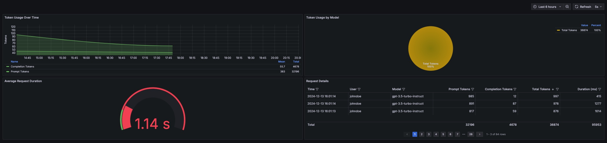

# LLM Token Usage Dashboard

This project provides tools to visualize LLM token usage metrics from Observicia telemetry logs using Grafana.



## Overview

The solution consists of two parts:
1. A Python script to convert Observicia telemetry logs to CSV format
2. A Grafana dashboard configuration that visualizes the token usage data

## Prerequisites

- Python 3.8+
- Grafana 9.0+
- Yesoreyeram Infinity Datasource plugin for Grafana

## Step 1: Convert Telemetry Logs to CSV

1. Run the [converter script](../util/log_to_csv.py) with the following arguments:
   - `--input`: Path to the telemetry log file
   - `--output`: Path to the output CSV file


1. Convert your telemetry log to CSV:
```bash
python log_to_csv.py --input telemetry.log --output token_usage.csv
```

## Step 2: Set Up Grafana

1. Install Infinity Datasource plugin:
   - Navigate to Configuration > Plugins
   - Search for "Infinity"
   - Install "Yesoreyeram Infinity Datasource"

2. Add Infinity datasource:
   - Go to Configuration > Data Sources
   - Click "Add data source"
   - Search for and select "Infinity"
   - Click "Save & Test"

3. Create the dashboard:
   - Click the "+" icon in the sidebar
   - Select "Import"
   - Paste the provided dashboard JSON
   - Update CSV file path in each panel's query to point to your `token_usage.csv`
   - Click "Import"

## Dashboard Features

The dashboard includes:

1. **Token Usage Over Time**
   - Line chart showing prompt and completion tokens
   - Includes mean and sum calculations

2. **Token Usage by Model**
   - Pie chart breakdown by model
   - Shows percentages and absolute values

3. **Average Request Duration**
   - Gauge showing mean request duration
   - Color-coded thresholds

4. **Request Details**
   - Detailed table view of all requests
   - Sortable columns
   - Pagination support


---
*This example is part of the [Observicia SDK](https://github.com/observicia/observicia) documentation.*