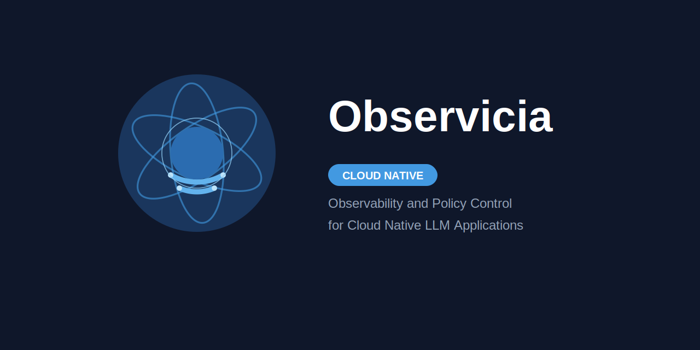

# Observicia SDK API Documentation

## Installation

```bash
pip install observicia
```

## Quick Start

```python
from observicia import init
from observicia.core.context_manager import ObservabilityContext

# Initialize SDK
init()

# Set user ID for tracking
ObservabilityContext.set_user_id("user123")
```

## Core APIs

### Initialization

#### `init()`
Initialize the Observicia SDK with optional configuration file.

```python
from observicia import init

init()  # Uses default configuration
```

Configuration can be provided via YAML file specified by `OBSERVICIA_CONFIG_FILE` environment variable:

```yaml
service_name: "my-service"
otel_endpoint: "http://localhost:4317"
opa_endpoint: "http://localhost:8181"
logging:
  file: "observicia.log"
  telemetry:
    enabled: true
    format: "json"
  messages:
    enabled: true
    level: "INFO"
  chat:
    enabled: true
    level: "both"
    file: "chat.log"
```

### Context Management

#### ObservabilityContext

The core class for managing observability context.

```python
from observicia.core.context_manager import ObservabilityContext

# Set user ID
ObservabilityContext.set_user_id("user123")

# Start a transaction
transaction_id = ObservabilityContext.start_transaction(
    metadata={"conversation_type": "chat"}
)

# End a transaction
ObservabilityContext.end_transaction(
    transaction_id,
    metadata={"resolution": "completed"}
)

# Get current user ID
user_id = ObservabilityContext.get_user_id()

# Get transaction details
transaction = ObservabilityContext.get_transaction(transaction_id)

# Get all active transactions
active_transactions = ObservabilityContext.get_active_transactions()
```

### Decorators

#### `@trace`
Basic tracing decorator for functions.

```python
from observicia import trace

@trace(policies=["pii"], trace_level="normal")
def process_user_input(text: str):
    return text.upper()
```

#### `@trace_rag`
Specialized decorator for RAG (Retrieval Augmented Generation) applications.

```python
from observicia import trace_rag

@trace_rag(policies=["retrieval_relevance"])
async def retrieve_and_generate(query: str):
    # RAG implementation
    pass
```

#### `@trace_stream`
Decorator for streaming responses.

```python
from observicia import trace_stream

@trace_stream(policies=["content_safety"])
async def stream_response(prompt: str):
    # Streaming implementation
    pass
```

### Policy Engine

#### PolicyEngine
Configure and enforce policies.

```python
from observicia.core.policy_engine import PolicyEngine, Policy

# Define policies
policies = [
    Policy(
        name="pii_detection",
        path="observicia/pii",
        description="Detect PII in text",
        required_trace_level="enhanced",
        risk_level="high"
    )
]

# Create policy engine
engine = PolicyEngine(
    opa_endpoint="http://localhost:8181",
    policies=policies
)

# Evaluate policies
result = await engine.evaluate_with_context(
    eval_context={"text": "some text"},
    prompt="user prompt",
    completion="assistant response"
)
```

### Token Tracking

#### TokenTracker
Track token usage across providers.

```python
from observicia.core.token_tracker import TokenTracker

tracker = TokenTracker()

# Update token usage
tracker.update("openai", prompt_tokens=10, completion_tokens=20)

# Get usage statistics
usage = tracker.get_usage("openai")
all_usage = tracker.get_usage_all_providers()

# Use streaming context
with tracker.stream_context("openai", "session123") as usage:
    usage.prompt_tokens += 5
    usage.completion_tokens += 10
```

### Provider Patching

#### PatchManager
Manage SDK patches for different LLM providers.

```python
from observicia.core.patch_manager import PatchManager

# Patch specific provider
with PatchManager() as manager:
    manager.patch_provider("openai")
    # Use OpenAI API normally - it's now tracked

# Or patch all supported providers
manager = PatchManager()
manager.patch_all()
```

## Utility Functions

### Tracing Utilities

```python
from observicia import get_current_span, get_current_context

# Get current span
span = get_current_span()
if span:
    span.set_attribute("custom.attribute", "value")

# Get current context
context = get_current_context()
```

## Supported LLM Providers

The SDK currently supports the following providers:
- OpenAI
- Ollama
- WatsonX
- (more to come)

Each provider can be patched to add observability features to their APIs.


## Error Handling

The SDK provides several exception types for error handling:

```python
try:
    # SDK operations
    pass
except ValueError as e:
    # Handle policy violations
    pass
except RuntimeError as e:
    # Handle runtime errors
    pass
```

## Best Practices

- Always initialize the SDK before use
- Set user ID when known for better tracing
- Use transactions for multi round chats
- Apply appropriate trace levels based on needs
- Configure policies based on risk requirements
